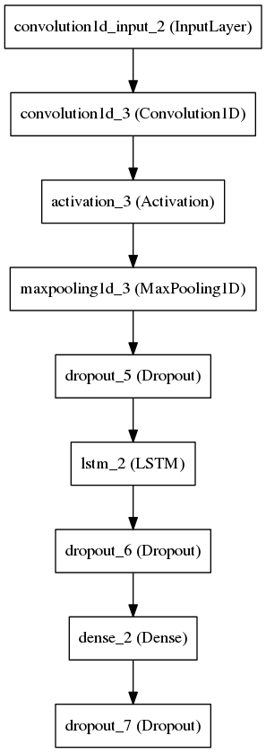
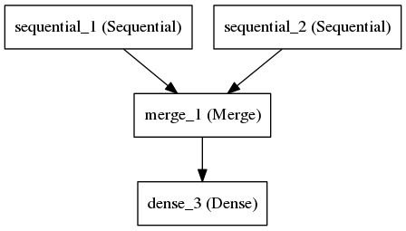

# Guide to Genre Recognition (From audio files to genres)

In this guide, I try to describe the steps needed to be taken to perform genre recognition.
Since this is a machine learning task, we shall follow the typical procedure of:

  * Preparing a dataset
  * Feature extraction
  * Training and testing model
  * Querying model

# Preliminaries
You need a unix system for anything to work.

This guide will show how to use the code. First clone the git repo, and switch the branch to working-model-0.1
```shell
git clone https://github.com/amirothman/genre-erkennung-pipeline
cd genre-erkennung-pipeline
git checkout working-model-0.1
```

Now you should have all the code. But not yet all the data and the dependencies. But first, let's go through the requirement:

  * keras (deep learning python framework)
  * sklearn (machine learning library)
  * matplotlib (plotting)
  * hdf5 (file format)
 
On Mac OS X hdf5 can be installed via `brew`
```shell
brew install homebrew/science/hdf5
```
  
To install the python libraries:
  * `sudo python3 -m pip install keras`
  * `sudo python3 -m pip install h5py`
  * `sudo python3 -m pip install sklearn`
  * `sudo python3 -m pip install matplotlib`

Outside of the python libraries we also require some command line tools:

  * [sonic-annotator](http://vamp-plugins.org/sonic-annotator/) (Vamp plug-in host, extraction utility)
  * youtube-dl (to query data)

Youtube-dl can be installed via
```shell
sudo curl https://yt-dl.org/latest/youtube-dl -o /usr/local/bin/youtube-dl
sudo chmod a+rx /usr/local/bin/youtube-dl
```
And we also need to install some Vamp plugins:

  * [QM-Vamp Plugins](https://code.soundsoftware.ac.uk/projects/qm-vamp-plugins/files)
  * [BBC Vamp Plugins](https://github.com/bbcrd/bbc-vamp-plugins/releases)

Refer to [here](http://mtg.upf.edu/technologies/melodia?p=Download%20and%20installation) for instructions to install vamp plugins on different platforms.

# Preparing a dataset

For legal reasons a dataset including music files can not be included. You have to use your own or a thid party one.

Most of the methods expect the folder "dataset" as the default directory path for the data. Create that folder inside the main project directory.
Inside this directory you can use different datasets.
Throughout the code base, we use the convention of _train_ set and _test_ set to separate our training data and testing data.
Now, you can put your data in the respective directories with each file in it's own genre folder. The code uses the name of the directory as the genre. Here is an example of how a dataset directory should look like:

```
└── my_data_set
    ├── test
    │   ├── genre1
    │   │   ├── 010._Ольга_Василюк_-_Нет_Тебя.mp3
    │   │   ├── 017._Eros_Ramazzotti_-_Perfetto.mp3
    │   │   └── 018._T.I._Feat._Pharrell_-_Oh_Yeah.mp3
    │   └── genre2
    │       ├── 011._Maan_-_Perfect_World__Prod._by_Hardwell_.mp3
    │       ├── 015._Глюкоза_-_Согрей.mp3
    │       └── 016._Вика_Воронина_Feat._Storm_Djs_-_Угги.mp3
    └── train
        ├── genre1
        │   ├── 004._Prides_-_Out_Of_The_Blue.mp3
        │   ├── 008._Марина_Алиева_-_Подари_Любовь.mp3
        │   └── 009._Чи-Ли_-_Ангел_На_Моём_Плече.mp3
        └── genre2
            ├── 001._Paul_Van_Dyk_-_Lights.mp3
            ├── 002._Zedd,_Bahari_-_Addicted_To_A_Memory.mp3
            └── 003._MOYYO_-_Имя_Moyyo.mp3

```

The bash script `splitTrainTest.sh` to automaticcaly split a dataset into test set and training set. The shall can be used for splitting but must be customized for the training set.

You can have as many genres as you want. Just make sure:

  * Both training and testing sets include the same genres
  * The split between test set and training set is sensible

The format of the audio can be any audio format that is supported by sonic-annotator and ffmpeg.
One preprocessing step before we continue to feature extraction is splitting the audio files into 30 second chunks - to make it more manageable

To do this, we can use the ``split_30_seconds.py`` script. The method used here is ``batch_thirty_seconds(folder_path)``. In our case, `folder_path` would be ``my_data_set``. You should edit this in the main part of the code.

* folder_path: string of data set path (where the folder train and test is)

Run `split_30_seconds.py` with:

```shell
python3 split_30_seconds.py <path to dataset>
```

If your audio files contain spaces or some other weird characters, this script will throw an error. You can use the script `space_to_underscore.sh` to rename them.

# Feature Extraction

Now we will do feature extraction with `sonic-annotator`. First we convert the audio files into CSV files with features, then convert the CSV files into Numpy arrays and serialize them with pickle.

The python script ``extract_features.py`` will be used here.

```shell
python extract_features.py <path to dataset or single file>
```
After running that script, you will realize a bunch of csv files in your dataset. It may take a while for this process to finish.
Now convert them into numpy arrays and pickle them, so you can reuse them. For this we will turn to ``parse_features.py``. The used method is ``build_vectors``

```python
build_vectors(folder_path,keyword,lower_limit)
```
* folder_path: string for path of dataset
* keyword: string for keyword of feature e.g. "spectral-contrast_peaks". This will be used to match the csv file output by sonic-annotator
* lower_limit: integer for the index of column of the csv file to use. The first column is a timestamp. Sometimes, we do not want this in our array.

For our example:

```python
build_vectors(folder_path="dataset/my_data_set",keyword="spectral-contrast_peaks",lower_limit=1)
build_vectors(folder_path="dataset/my_data_set",keyword="mfcc_coefficients",lower_limit=1)
```
As before pass the path to the dataset.

```shell
python parse_features.py <path to dataset>
```

If you check the folder pickled_vectors you should have your pickled vectors saved there.
If it is empty, you probably messed up something. Call the ambulance.

# Training Model

This is the machine learning step. The most interesting step. There are two separate models for the two different features. The models are in two different scripts, mfcc_model.py and spectral-contrast_peaks_model.py. The merged model is in the script prototype_merged.py. You can train each model separately or combining them. Let's try just one model first, then the other one then the merged one.

## MFCC Model


Change the X, y, X_test, and y_test variable to load the pickled vectors of your desire. If you are following this tutorial, it would be:
```python
X = pickle.load(open("pickled_vectors/mfcc_coefficients_training_vector.pickle","rb"))
y = pickle.load(open("pickled_vectors/mfcc_coefficients_label.pickle","rb"))

X_test = pickle.load(open("pickled_vectors/mfcc_coefficients_evaluation_training_vector.pickle","rb"))
y_test = pickle.load(open("pickled_vectors/mfcc_coefficients_evaluation_label.pickle","rb"))
```

Now you can run this model with:

```shell
python3 mfcc_model.py
```

Or if you have configured CUDA on your machine, you can also use keras_gpu.sh. This is probably the wrongest hackiest way to run Theano code with Cuda but, it works for now.

```shell
sh keras_gpu.sh mfcc_model.py
```

You may change the amount of used genres in `mfcc_model.py` by changing `numGenres = 3`.

## Spectral Contrast Model



As before, change the X, y, X_test, and y_test variable to load the pickled vectors of your desire. For our example:
```python
X = pickle.load(open("pickled_vectors/spectral-contrast_peaks_training_vector.pickle","rb"))
y = pickle.load(open("pickled_vectors/spectral-contrast_peaks_label.pickle","rb"))

X_test = pickle.load(open("pickled_vectors/spectral-contrast_peaks_evaluation_training_vector.pickle","rb"))
y_test = pickle.load(open("pickled_vectors/spectral-contrast_peaks_evaluation_label.pickle","rb"))
```

Now you can run this model with:
```shell
python spectral_contrast_peaks_model.py
```

Or if you have configured CUDA on your machine, you can also use keras_gpu.sh. This is probably the wrongest hackiest way to run Theano code with Cuda but, it works for now.

    sh keras_gpu.sh spectral_contrast_peaks_model.py

You may change the amount of used genres in `mfcc_model.py` by changing `numGenres = 3`.

## Merged Model



Here, we have merged model. It combining the two previous model and concatenate them into one model. We have two different example (X vectors), so a bit different than before, we will have to change X_1, X_2, X_test_1, X_test_2, y and y_test. For our example:
```python
y = pickle.load(open("pickled_vectors/mfcc_coefficients_label.pickle","rb"))
y_test = pickle.load(open("pickled_vectors/mfcc_coefficients_evaluation_label.pickle","rb"))

X_1 = pickle.load(open("pickled_vectors/mfcc_coefficients_training_vector.pickle","rb"))
X_test_1 = pickle.load(open("pickled_vectors/mfcc_coefficients_evaluation_training_vector.pickle","rb"))

X_2 = pickle.load(open("pickled_vectors/spectral-contrast_peaks_training_vector.pickle","rb"))
X_test_2 = pickle.load(open("pickled_vectors/spectral-contrast_peaks_evaluation_training_vector.pickle","rb"))
```
One thing that you may have to further edit is the number of outputs of your neural network. On this line:
```python
model.add(Dense(2))
```
2 refers to two genres. Change it to the amount of genres.

Now you can run this model with:

```shell
python3 prototype_merged.py
```

Or if you have configured CUDA on your machine, you can also use keras_gpu.sh. This is probably the wrongest hackiest way to run Theano code with Cuda but, it works for now.

    sh keras_gpu.sh prototype_merged.py

# Querying The Model

Now you would like to ask the model. By giving it a song, what would the model predict? Firstly, the song which the model would need to predict, would have to go through the whole pipeline.

The merge model, saved it's architecture into a json file. This happened in the following part of the prototype_merged.py

```python
json_string = final_model.to_json()
with open("model_architecture/merged_model_architecture.json","w") as f:
    f.write(json.dumps(json_string, sort_keys=True,indent=4, separators=(',', ': ')))
```

The trained weights should be saved in the following hdf5 file:

    model_weights/merged_model_weights.hdf5

So what we have to do to query the model are:
  * extract the features from the song
  * load the model architecture
  * load the model weights
  * get some prediction


For this purpose, the script querying_genre.py is made. Make sure the right architecture is loaded:
```python
json_string = json.load(open("model_architecture/merged_model_architecture.json","r"))
````
And also the right weights:

    model.load_weights("model_weights/merged_model_weights.hdf5")

###An example
```shell
getGenreFromYoutube.sh https://www.youtube.com/watch?v=VDvr08sCPOc
```

An example of the output would be something like:

```
Detected rock hiphop hiphop hiphop rock hiphop rock hiphop hiphop rock 
The song is 60.0 % hiphop
```
What does this mean? The song is split into 30 seconds chunks. The model predicts a genre for each chunk which are then averaged.
